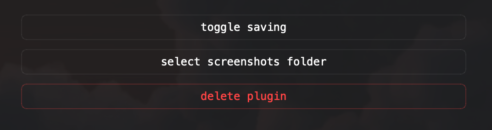

<div align="center">
    <pre>
    ____  __.  _________ ___ ___ ___________________
    |    |/ _| /   _____//   |   \\_____  \__    ___/
    |      <   \_____  \/    ~    \/   |   \|    |   
    |    |  \  /        \    Y    /    |    \    |   
    |____|__ \/_______  /\___|_  /\_______  /____|   
            \/        \/       \/         \/         
    </pre>
</div>
<p align="center">
    standard screenshot utility for ktools.
</p>
<p align="center">
    
    
</p>

⠀

# what is this?

kshot is the standard screenshot utility for ktools. it wraps the native macOS screencapture utility into a managed background worker, allowing u to instantly capture regions of ur screen and pipe the result directly to ur clipboard or a designated local folder.

fun fact: every screenshot in my repos made with it

### features

* native capture: utilizes macOS system-level screencapture for perfect pixel data.
* async processing: runs in a background QThread to prevent UI blocking during image processing.
* smart clipboard: images are immediately available for paste.
* disk persistence: configurable auto-save to local storage with automated file naming.

⠀

# how to use

### 1. summoning the tool

just hit

```
⌥⌘` (option + command + backtick)
```

global event monitors capture this shortcut anywhere in the OS.

### 2. capture flow

* once triggered, ur cursor turns into the native macOS selection crosshair.
* define the area you want to grab.
* kshot processes the resulting data in the background and hits ur system clipboard.
* if disk saving is enabled, it writes a timestamped .png to ur configured path.

⠀

# configuration

the kshot.json dictates everything. u can set it up using buttons in ktools plugin manager.



* toogle saving.
* select screenshots folder: opens a native system dialog to select the destination directory for screenshots.

⠀

### final thoughts

im tired of this already...

by kriaiss.